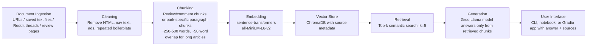

# Project 1 Planning: The Unofficial Guide

> Write this document before you write any pipeline code.

> Your spec and architecture diagram are what you'll use to direct AI tools (Claude, Copilot, etc.) to generate your implementation — the more specific they are, the more useful the generated code will be.

> Update the Retrieval Approach and Chunking Strategy sections if you change your approach during implementation.

> Update this file before starting any stretch features.

---

## Domain

<!-- What domain did you choose? Why is this knowledge valuable and hard to find through official channels? -->

The domain I chose is parks in the LAarea. This knowledge is valuable because LA has many parks and different parks are useful for very different purposes. his information is hard to find through one official source because official park pages usually list amenities and addresses, while Reddit, Yelp, Tripadvisor, newspapers, and travel blogs contain more practical opinions about what each park is actually good for.

---

## Documents

<!-- List your specific sources: URLs, subreddit names, forum threads, or file descriptions.

     Aim for at least 10 sources that together cover different subtopics or perspectives within your domain. -->

| #  | Source                                                                    | Type                                        | URL or file path                                                                                                                                                                             |

| -- | ------------------------------------------------------------------------- | ------------------------------------------- | -------------------------------------------------------------------------------------------------------------------------------------------------------------------------------------------- |

| 1  | Reddit thread: “LA parks are now ranked 93rd out of 100 of the...”        | Reddit discussion / community reviews       | https://www.reddit.com/r/LosAngeles/comments/1tq8bqp/la_parks_are_now_ranked_93rd_out_of_100_of_the/?utm_source=share&utm_medium=web3x&utm_name=web3xcss&utm_term=1&utm_content=share_button |

| 2  | Reddit thread: “Best scenic parks in LA?”                                 | Reddit discussion / recommendations         | https://www.reddit.com/r/AskLosAngeles/comments/1k6krhx/best_scenic_parks_in_la/?utm_source=share&utm_medium=web3x&utm_name=web3xcss&utm_term=1&utm_content=share_button                     |

| 3  | Reddit thread: “Best parks for picnics?”                                  | Reddit discussion / recommendations         | https://www.reddit.com/r/AskLosAngeles/comments/1omxq33/best_parks_for_picnics/?utm_source=share&utm_medium=web3x&utm_name=web3xcss&utm_term=1&utm_content=share_button                      |

| 4  | Discover Los Angeles: “The Guide to Los Angeles Parks”                    | Travel / tourism guide                      | https://www.discoverlosangeles.com/things-to-do/the-guide-to-los-angeles-parks                                                                                                               |

| 5  | City of Los Angeles Department of Recreation and Parks: Park addresses    | Official government park directory          | https://recreation.parks.lacity.gov/parks                                                                                                                                                    |

| 6  | Los Angeles Times: “Chill Los Angeles parks for hanging out and relaxing” | Newspaper / lifestyle article               | https://www.latimes.com/lifestyle/list/chill-los-angeles-parks-for-hanging-out-and-relaxing                                                                                                  |

| 7  | Tripadvisor: Best parks in Los Angeles                                    | Review platform / travel rankings           | https://www.tripadvisor.com/Attractions-g32655-Activities-c57-t70-Los_Angeles_California.html                                                                                                |

| 8  | Yelp: Parks in Los Angeles, CA                                            | Review platform / local business listings   | https://www.yelp.com/search?find_desc=Parks&find_loc=Los+Angeles%2C+CA                                                                                                                       |

| 9  | Modern Luxury: “Best Parks in Los Angeles”                                | Lifestyle article / curated recommendations | https://www.modernluxury.com/best-parks-los-angeles/                                                                                                                                         |

| 10 | Hotels.com: “Best Parks in Los Angeles”                                   | Travel guide / curated recommendations      | http://de.hotels.com/go/usa/best-parks-los-angeles                                                                                                                                           |

---

## Chunking Strategy

<!-- How will you split documents into chunks?

     State your chunk size (in tokens or characters), overlap size, and explain why those

     numbers fit the structure of your documents.

     A review-heavy corpus warrants different chunking than a long FAQ. -->

**Chunk size:**

Since my database consist of varying types of content, I'll try to have different chunk sizes for different types of documents. 

- Reddit / Reviews: By comment (whenever possible) 

- Articles: By park section / paragraph group

I think a firm 250 -500 words per chunk could work.

**Overlap:**

For articles, longer reviews, etc 50 words.

Standalone reviews should have no overlap. 

**Reasoning:**

This size should be large enough for a chunk to contain a complete recommendation or reason, but small enough that retrieval can match specific user queries like “picnic,” “scenic,” or “quiet park” without pulling in unrelated parks.

---

## Retrieval Approach

<!-- Which embedding model are you using (e.g., all-MiniLM-L6-v2 via sentence-transformers)?

     How many chunks will you retrieve per query (top-k)?

     If you were deploying this for real users and cost wasn't a constraint, what tradeoffs

     would you weigh in choosing a different embedding model — context length, multilingual

     support, accuracy on domain-specific text, latency? -->

**Embedding model:**

all-MiniLM-L6-v2 via sentence-transformers

**Top-k:**

top-k = 5

**Production tradeoff reflection:**

This should provide enough context for questions that may have multiple good answers, such as “best picnic parks,” without overwhelming the LLM with too much unrelated text. The system should answer only from retrieved chunks. If the documents do not contain enough information, then it should just state that rather than making up an answer.

---

## Evaluation Plan

<!-- List your 5 test questions with their expected correct answers.

     Questions should be specific enough that you can judge whether the system's response

     is right or wrong. "What are good dining halls?" is too vague.

     "What do students say about wait times at [dining hall name] during lunch?" is testable. -->

| # | Question | Expected answer |

|---|----------|-----------------|

| 1 |Which LA parks are recommended for scenic views? |parks that appear in the scenic parks Reddit thread and/or travel guides, and explain why they are scenic based on retrieved source text |

| 2 |Which parks are recommended for picnics? | Identifty parks mentioned in the picnic focused Reddit threador guide articles as good picnic options, cite sources|

| 3 |Which parks seem good for relaxing or hanging out alone? |The answer should draw from the LA Times relaxing/chill parks source and any Reddit comments that discuss calm, quiet, or solo-friendly parks|

| 4 |What are some differences between official park information and user review information? The answer should explain that official sources provide structured details like park names, addresses, or facilities, while Reddit/Yelp/Tripadvisor provide subjective opinions, use cases, and personal experiences|

| 5 |Which park is best for someone who wants a beach park with views? | The answer should retrieve chunks mentioning beach-adjacent or coastal/scenic parks. If the sources do not clearly support one best answer, the system should present options rather than invent a single definitive answer|

---

## Anticipated Challenges

<!-- What could go wrong? Name at least two specific risks with reasoning.

     Consider: noisy or inconsistent documents, missing source attribution, off-topic

     retrieval, chunks that split key information across boundaries. -->

1.A park that one person describes as relaxing may be crowded or inconvenient for someone else, so the subjectiveness of recommendations might introduce noise...

2.Review-style sources may mention many parks casually without giving detailed reasons, which could make retrieval harder

---

## Architecture

<!-- Draw a diagram of your pipeline showing the five stages:

     Document Ingestion → Chunking → Embedding + Vector Store → Retrieval → Generation

     Label each stage with the tool or library you're using.

     You can use ASCII art, a Mermaid diagram, or embed a sketch as an image.

     You'll use this diagram as context when prompting AI tools to implement each stage. -->

---

## AI Tool Plan

<!-- For each part of the pipeline below, describe:

     - Which AI tool you plan to use (Claude, Copilot, ChatGPT, etc.)

     - What you'll give it as input (which sections of this planning.md, which requirements)

     - What you expect it to produce

     - How you'll verify the output matches your spec

     "I'll use AI to help me code" is not a plan.

     "I'll give Claude my Chunking Strategy section and ask it to implement chunk_text()

     with my specified chunk size and overlap" is a plan. -->

I plan to use AI tools for specific implementation help, not to replace my design decisions. I may ask Claude to help me:

- Debug the document ingestion script that loads my saved text files and attaches metadata.
- Implement the chunking function based on my planned chunking strategy.
- Explain ChromaDB or sentence-transformers code 
- Help debug retrieval results by comparing a query with the chunks returned.

I will make the domain, document, chunking, and evaluation decisions myself, then use Claude to help translate those decisions into code.

**Milestone 3 — Ingestion and chunking:**

- **AI tool:** Claude
- **Input:** My Documents table (source names, types, file paths) and the Chunking Strategy section of this planning.md
- **Expected output:** A `load_documents()` function that reads saved text files from the `documents/` folder, attaches metadata (source name, type, URL), and a `chunk_text()` function that splits by comment/paragraph for Reddit sources and by paragraph group for articles, with 250–500 word chunks and 50-word overlap for long-form content and no overlap for standalone reviews
- **Verification:** I will manually inspect 3–5 chunks from different source types to confirm chunk boundaries make sense, metadata is attached correctly, and chunk sizes fall within the target range

**Milestone 4 — Embedding and retrieval:**

- **AI tool:** Claude
- **Input:** My Retrieval Approach section (embedding model: all-MiniLM-L6-v2, top-k=5) and the Architecture diagram showing the ChromaDB vector store stage
- **Expected output:** An `embed_and_store()` function that encodes chunks with sentence-transformers and upserts them into ChromaDB with source metadata, and a `retrieve()` function that takes a query string and returns the top-5 most similar chunks with their source labels
- **Verification:** I will run 2–3 queries from my Evaluation Plan (e.g., "scenic parks", "picnic parks") and manually check that the returned chunks are relevant and that source attribution is present

**Milestone 5 — Generation and interface:**

- **AI tool:** Claude
- **Input:** The Architecture diagram (Groq Llama generation stage, CLI/Gradio interface stage), retrieved chunks format from Milestone 4, and my requirement that the system answer only from retrieved chunks and say "I don't know" when sources are insufficient
- **Expected output:** A `generate_answer()` function that builds a prompt from retrieved chunks and calls the Groq API, and a simple interface (CLI or Gradio) that takes a user question, displays the answer, and lists the source documents used
- **Verification:** I will run all 5 test questions from my Evaluation Plan and check that answers cite real sources, do not hallucinate parks not in the retrieved chunks, and correctly decline to answer when the corpus lacks relevant information
